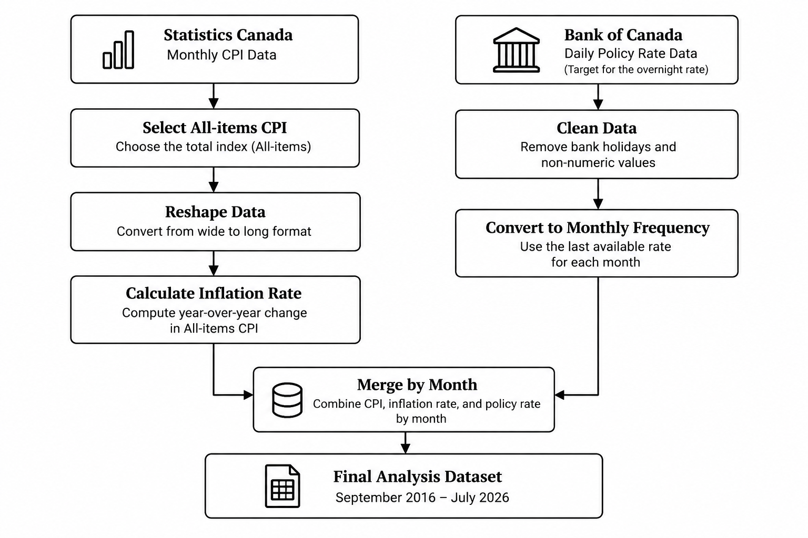
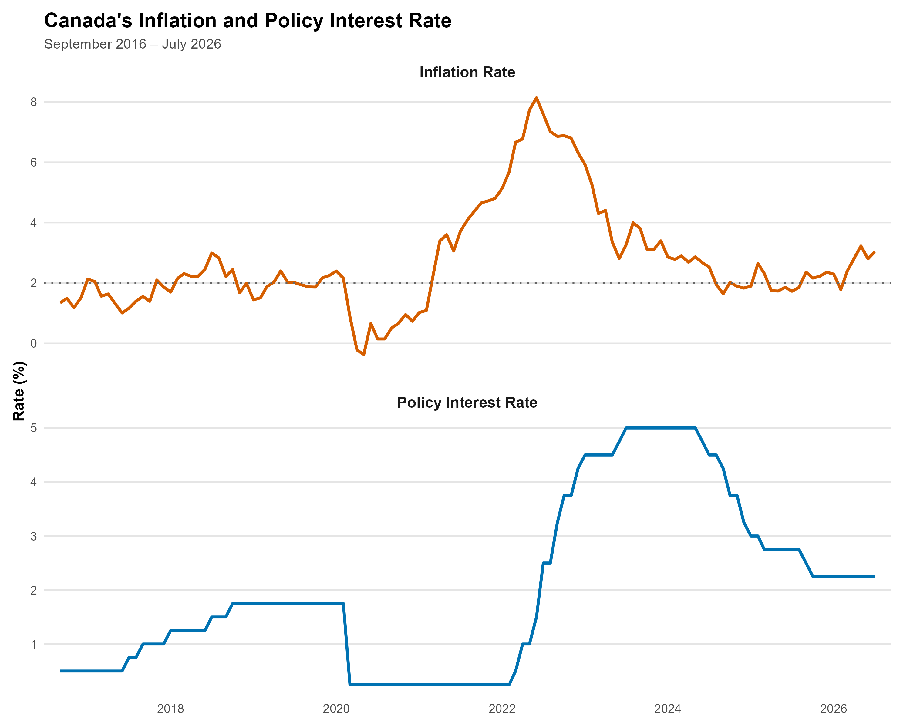

# 1. Introduction

One of the Bank of Canada's main means of affecting economic conditions and ensuring price stability is by adjusting interest rates. In the last ten years, Canada's monetary policy went through a number of different phases, starting with a period of slow tightening prior to the COVID-19 pandemic, then moving on to emergency cuts in interest rates in 2020, and afterwards undergoing a vigorous tightening phase during the inflation shock of 2022.

The analysis looks at the changes that took place in Canada's policy interest rate between September 2016 and July 2026 and at the way these changes correlated with movements in consumer price inflation.

The study looks at the timing and size of the changes in the policy interest rate, the way in which inflation has evolved in relation to the Bank of Canada's 2% target, and the shift from monetary tightening to monetary easing.

The aim is not to determine a causal link between interest rates and inflation, but rather to look at the timing and patterns in the data and to identify the main stages of the cycle of Canada's monetary policy.

## 1.1 Research Question

How did monetary policy respond to rising inflation in Canada between September 2016 and July 2026?

# 2. Data and Methodology

This analysis combines two key Canadian macroeconomic indicators: consumer price inflation and the Bank of Canada's policy interest rate.

**Consumer Price Index (CPI)** Monthly Consumer Price Index data were obtained from Statistics Canada. The analysis uses the All-items CPI series, with observations extending from January 2015 through July 2026.

**Policy Interest Rate** Daily policy interest rate data were obtained from the Bank of Canada. The analysis uses the target for the overnight rate (V39079), Canada's key policy interest rate. The original dataset covers September 2016 through August 2026.

Because the inflation data are available monthly through July 2026, the combined analysis covers the common period from September 2016 to July 2026.

### Variables

| Variable       | Description                                           |
|----------------|-------------------------------------------------------|
| CPI            | Monthly All-items Consumer Price Index                |
| Inflation Rate | Year-over-year percentage change in the All-items CPI |
| Policy Rate    | Bank of Canada's target for the overnight rate        |

```{r echo=FALSE, warning=FALSE, message=FALSE}
library(readr)
library(dplyr)

policy_rate_raw <- read_csv(
  "policy_rate_raw.csv",
  skip = 11,
  show_col_types = FALSE
)
```

## 2.1 Data Preparation

The two datasets required different preparation steps before they could be combined. The CPI data were transformed from a wide monthly format into a time-series structure, while the daily policy-rate data were cleaned and converted to monthly frequency.



The resulting dataset contains the monthly All-items CPI, year-over-year inflation rate, and policy interest rate for the common analysis period.

## 2.2 Analytical Approach

The analysis examines Canada's monetary policy cycle through several complementary approaches.

First, the policy interest rate is examined over time to identify major periods of monetary tightening and easing.

Second, inflation and the policy rate are compared to examine how the two indicators evolved relative to each other and how inflation moved around the Bank of Canada's 2% target.

Third, the analysis divides the study period into five broad economic phases:

- Pre-pandemic
- Pandemic & Recovery
- Inflation Shock & Tightening
- Easing
- Stabilization

Average inflation and the average policy rate are calculated for each phase to compare inflationary conditions with the prevailing monetary policy stance.

Finally, key turning points are identified by measuring the inflation peak, the policy-rate peak, and the time between the two. Changes in inflation and the policy rate following their respective peaks are also calculated.

## 2.3 Scope and Limitations

This analysis is descriptive rather than causal. The comparison of inflation and the policy interest rate identifies patterns, timing, and changes in the two indicators, but it does not establish that changes in the policy rate alone caused subsequent changes in inflation.

Inflation is influenced by multiple economic factors, including supply conditions, energy prices, labour-market conditions, exchange rates, and consumer demand. These factors are outside the scope of this analysis.

# 3. Results

This section shows the main results of the analysis. It looks at changes in the policy rate, when inflation and policy-rate peaks happened, and how these varied across major economic periods. Tables and figures highlight the key patterns in the data.

## 3.1 Policy Rate Changes

Throughout the study period the policy rate went through a number of distinct stages. It rose gradually prior to the pandemic, dropped sharply to 0.25% in 2020, and then increased quickly as a result of the inflation shock. After having reached a peak of 5.00% in 2023 the policy rate started to fall.

```{r echo=FALSE, warning=FALSE, message=FALSE}
#| output: false
policy_rate <- policy_rate_raw %>%
  mutate(
    policy_rate = as.numeric(V39079)
  )
policy_rate <- policy_rate %>%
  filter(!is.na(policy_rate))
```

```{r echo=FALSE, warning=FALSE, message=FALSE}
#| output: false
policy_rate <- policy_rate %>%
  select(Date, policy_rate)
```

```{r echo=FALSE, warning=FALSE, message=FALSE}
#| output: false
str(policy_rate)
```

```{r echo=FALSE, warning=FALSE, message=FALSE}
#| output: false
sum(is.na(policy_rate$policy_rate))
range(policy_rate$Date)
sum(duplicated(policy_rate$Date))
sort(unique(policy_rate$policy_rate))
```

```{r echo=FALSE, warning=FALSE, message=FALSE}
#| output: false
write_csv(
  policy_rate,
  "policy_rate.csv"
)
```

```{r echo=FALSE, warning=FALSE, message=FALSE}
#| output: false
policy_changes <- policy_rate %>%
  arrange(Date) %>%
  mutate(
    previous_rate = lag(policy_rate),
    change = policy_rate - previous_rate
  )
```

```{r echo=FALSE, warning=FALSE, message=FALSE}
#| output: false
policy_summary <- policy_rate %>%
  summarise(
    starting_rate = first(policy_rate),
    ending_rate = last(policy_rate),
    minimum_rate = min(policy_rate),
    maximum_rate = max(policy_rate),
    average_rate = mean(policy_rate),
    total_changes = sum(policy_rate != lag(policy_rate), na.rm = TRUE),
    increases = sum(policy_rate > lag(policy_rate), na.rm = TRUE),
    decreases = sum(policy_rate < lag(policy_rate), na.rm = TRUE),
    net_change = last(policy_rate) - first(policy_rate)
  )
```

```{r echo=FALSE, warning=FALSE, message=FALSE}
#| output: false
policy_turning_points <- policy_rate %>%
  summarise(
    lowest_rate = min(policy_rate),
    lowest_rate_date = Date[which.min(policy_rate)],
    highest_rate = max(policy_rate),
    highest_rate_date = Date[which.max(policy_rate)]
  )
```

### Table 1. Summary Statistics of Canada's Policy Interest Rate, September 2016–July 2026

| Metric               | Result   |
|----------------------|----------|
| Starting policy rate | 0.50%    |
| Ending policy rate   | 2.25%    |
| Minimum policy rate  | 0.25%    |
| Maximum policy rate  | 5.00%    |
| Average policy rate  | 2.02%    |
| Total rate changes   | 27       |
| Rate increases       | 15       |
| Rate decreases       | 12       |
| Net change           | +1.75 pp |

This table summarizes the overall level and direction of changes in Canada's policy interest rate during the study period, including the starting and ending rates, the range of rates, and the number of increases and decreases.

```{r echo=FALSE, warning=FALSE, message=FALSE}
#| output: false
mean(policy_rate$policy_rate)
```

```{r echo=FALSE, warning=FALSE, message=FALSE}
#| output: false
rate_changes <- policy_changes %>%
  filter(change != 0, !is.na(change))
```

```{r echo=FALSE, warning=FALSE, message=FALSE}
#| output: false
rate_changes <- rate_changes %>%
  mutate(
    direction = if_else(
      change > 0,
      "Increase",
      "Decrease"
    )
  )
```

```{r echo=FALSE, warning=FALSE, message=FALSE}
#| output: false
largest_changes <- rate_changes %>%
  summarise(
    largest_increase = max(change),
    largest_decrease = min(change),
    date_largest_increase = Date[which.max(change)],
    date_largest_decrease = Date[which.min(change)]
  )
```

### Table 2. Major Policy Rate Cycles, September 2016–July 2026

| Policy Cycle         | Starting Rate | Ending Rate | Change   |
|----------------------|---------------|-------------|----------|
| 2017–2018 Tightening | 0.50%         | 1.75%       | +1.25 pp |
| 2020 Pandemic Easing | 1.75%         | 0.25%       | −1.50 pp |
| 2022–2023 Tightening | 0.25%         | 5.00%       | +4.75 pp |
| 2024–2025 Easing     | 5.00%         | 2.25%       | −2.75 pp |

```{r echo=FALSE, warning=FALSE, message=FALSE}
#| output: false
rate_changes
```

This table highlights the major tightening and easing phases of Canada's monetary policy cycle and shows the change in the policy rate within each phase.

```{r echo=FALSE, warning=FALSE, message=FALSE}
#| output: false
table(rate_changes$direction)
```

```{r echo=FALSE, warning=FALSE, message=FALSE}
#| output: false
sum(rate_changes$change > 0)
sum(rate_changes$change < 0)
```

```{r echo=FALSE, warning=FALSE, message=FALSE}
#| output: false
sum(rate_changes$change[rate_changes$change > 0])
sum(rate_changes$change[rate_changes$change < 0])
```

```{r echo=FALSE, warning=FALSE, message=FALSE}
#| output: false
rate_changes
```

```{r echo=FALSE, warning=FALSE, message=FALSE}
#| output: false
print(rate_changes, n = 27)
```

```{r echo=FALSE, warning=FALSE, message=FALSE}
#| output: false
library(ggplot2)
policy_rate_chart <- ggplot(policy_rate, aes(x = Date, y = policy_rate)) +
  
  # Major policy periods
  annotate(
    "rect",
    xmin = as.Date("2017-01-01"),
    xmax = as.Date("2018-12-31"),
    ymin = -Inf,
    ymax = Inf,
    fill = "#EAF2F8",
    alpha = 0.6
  ) +
  
  annotate(
    "rect",
    xmin = as.Date("2020-03-01"),
    xmax = as.Date("2021-12-31"),
    ymin = -Inf,
    ymax = Inf,
    fill = "#FDEDEC",
    alpha = 0.6
  ) +
  
  annotate(
    "rect",
    xmin = as.Date("2022-01-01"),
    xmax = as.Date("2023-12-31"),
    ymin = -Inf,
    ymax = Inf,
    fill = "#E8F8F5",
    alpha = 0.6
  ) +
  
  annotate(
    "rect",
    xmin = as.Date("2024-01-01"),
    xmax = as.Date("2025-12-31"),
    ymin = -Inf,
    ymax = Inf,
    fill = "#FCF3CF",
    alpha = 0.6
  ) +
  
  # Policy rate
  geom_step(
    linewidth = 1.2,
    color = "#0072B2"
  ) +
  
  # Key points
  geom_point(
    data = policy_rate %>%
      filter(
        Date == as.Date("2020-03-27") |
          Date == as.Date("2023-07-13") |
          Date == as.Date("2026-07-31")
      ),
    size = 3,
    color = "#D55E00"
  ) +
  
  # Peak label
  annotate(
    "text",
    x = as.Date("2023-07-13"),
    y = 5.25,
    label = "Peak: 5.00%",
    fontface = "bold",
    size = 4
  ) +
  
  # Pandemic low label
  annotate(
    "text",
    x = as.Date("2020-06-01"),
    y = 0.65,
    label = "Pandemic low: 0.25%",
    fontface = "bold",
    size = 3.5
  ) +
  
  labs(
    title = "Canada's Policy Interest Rate Cycle",
    subtitle = "Target for the overnight rate | September 2016 – July 2026",
    x = NULL,
    y = "Policy interest rate (%)"
  ) +
  
  scale_y_continuous(
    breaks = seq(0, 5, 1),
    limits = c(0, 5.6)
  ) +
  
  scale_x_date(
    date_breaks = "2 years",
    date_labels = "%Y"
  ) +
  
  theme_minimal(base_size = 12) +
  
  theme(
    plot.title = element_text(
      face = "bold",
      size = 17
    ),
    plot.subtitle = element_text(
      size = 11,
      color = "grey30"
    ),
    axis.title.y = element_text(
      face = "bold"
    ),
    panel.grid.minor = element_blank(),
    panel.grid.major.x = element_blank(),
    legend.position = "none"
  )

ggsave(
  "images/policy_rate_chart.png",
  plot = policy_rate_chart,
  width = 10,
  height = 6,
  dpi = 300
)
```

### Figure 1. Canada's Policy Interest Rate, September 2016–July 2026


```{r echo=FALSE,warning=FALSE, message=FALSE}
#| output: false
inflation <- read_csv(
  "inflation.csv",
  show_col_types = FALSE
)
```

```{r echo=FALSE, message=FALSE, warning=FALSE}
#| output: false
inflation_all_items <- inflation %>%
  filter(Geography == "All-items")
```

```{r echo=FALSE, message=FALSE, warning=FALSE}
#| output: false
library(tidyverse)
inflation_long <- inflation_all_items %>%
  pivot_longer(
    cols = -Geography,
    names_to = "Date",
    values_to = "CPI"
  )
```

```{r echo=FALSE, message=FALSE, warning=FALSE}
#| output: false
inflation_long <- inflation_long %>%
  mutate(
    Date = as.Date(Date)
  )
inflation_long <- inflation_long %>%
  arrange(Date) %>%
  mutate(
    inflation_rate = (CPI / lag(CPI, 12) - 1) * 100
  )
```

```{r echo=FALSE, warning=FALSE, message=FALSE}
#| output: false
head(inflation_long, 20)
tail(inflation_long)
```

```{r echo=FALSE, warning=FALSE, message=FALSE}
#| output: false
policy_monthly <- policy_rate %>%
  mutate(
    month = format(Date, "%Y-%m")
  ) %>%
  group_by(month) %>%
  slice_max(Date, n = 1, with_ties = FALSE) %>%
  ungroup() %>%
  select(month, policy_rate)
```

```{r echo=FALSE, warning=FALSE, message=FALSE}
#| output: false
head(policy_monthly)
tail(policy_monthly)
```

```{r echo=FALSE, message=FALSE, warning=FALSE}
#| output: false
policy_monthly <- policy_monthly %>%
  mutate(
    Date = as.Date(paste0(month, "-01"))
  ) %>%
  select(Date, policy_rate)
```

```{r echo=FALSE, message=FALSE, warning=FALSE}
#| output: false
combined_data <- inflation_long %>%
  left_join(
    policy_monthly,
    by = "Date"
  )
```

```{r echo=FALSE, message=FALSE, warning=FALSE}
#| output: false
head(combined_data, 15)
tail(combined_data, 15)
```

```{r echo=FALSE, message=FALSE, warning=FALSE}
#| output: false
analysis_data <- combined_data %>%
  filter(
    Date >= as.Date("2016-09-01"),
    Date <= as.Date("2026-07-01")
  )
```

```{r echo=FALSE, message=FALSE, warning=FALSE}
#| output: false
range(analysis_data$Date)
dim(analysis_data)
```

```{r echo=FALSE, message=FALSE, warning=FALSE}
#| output: false
policy_rate_area <- analysis_data %>%
  filter(
    !is.na(policy_rate),
    Date >= as.Date("2016-09-01"),
    Date <= as.Date("2026-07-01")
  ) %>%
  ggplot(
    aes(x = Date, y = policy_rate)
  ) +
  
  # --------------------------------
# Policy rate area
# --------------------------------

geom_area(
  fill = "#0072B2",
  alpha = 0.18
) +
  
  geom_line(
    color = "#0072B2",
    linewidth = 1.1
  ) +
  
  # --------------------------------
# Pandemic low
# --------------------------------

annotate(
  "point",
  x = as.Date("2020-04-01"),
  y = 0.25,
  size = 3.5,
  color = "#D55E00"
) +
  
  annotate(
    "text",
    x = as.Date("2020-04-01"),
    y = 0.65,
    label = "Pandemic low: 0.25%",
    fontface = "bold",
    size = 3.3
  ) +
  
  # --------------------------------
# Policy peak
# --------------------------------

annotate(
  "point",
  x = as.Date("2023-07-01"),
  y = 5,
  size = 3.5,
  color = "#D55E00"
) +
  
  annotate(
    "text",
    x = as.Date("2023-07-01"),
    y = 5.35,
    label = "Policy peak: 5.00%",
    fontface = "bold",
    size = 3.3,
    hjust = 0.5
  ) +
  
  # --------------------------------
# Titles
# --------------------------------

labs(
  title = "Canada's Policy Interest Rate Cycle",
  subtitle = "Target for the overnight rate | September 2016 – July 2026",
  x = NULL,
  y = "Policy interest rate (%)"
) +
  
  # --------------------------------
# Axes
# --------------------------------

scale_y_continuous(
  breaks = seq(0, 5, 1),
  limits = c(0, 5.6),
  expand = c(0, 0)
) +
  
  scale_x_date(
    date_breaks = "2 years",
    date_labels = "%Y",
    expand = expansion(mult = c(0.02, 0.02))
  ) +
  
  # --------------------------------
# Minimalist theme
# --------------------------------

theme_minimal(base_size = 12) +
  
  theme(
    plot.title = element_text(
      face = "bold",
      size = 17
    ),
    
    plot.subtitle = element_text(
      size = 11,
      color = "grey30"
    ),
    
    axis.title.y = element_text(
      face = "bold"
    ),
    
    panel.grid.minor = element_blank(),
    
    panel.grid.major.x = element_blank(),
    
    panel.grid.major.y = element_line(
      color = "grey90"
    ),
    
    plot.margin = margin(
      10, 15, 10, 10
    )
  )
ggsave(
  "images/policy_rate_area.png",
  plot = policy_rate_area,
  width = 10,
  height = 6,
  dpi = 300
)
```

## 3.2 Inflation and Policy Rate Peaks.

During this period, inflation and the policy rate hit their highest levels at different times. Inflation peaked first, and the policy rate reached its peak afterward.

### Table 3. Inflation and Policy Rate Turning Points, September 2016–July 2026

| Indicator            | Peak Rate | Date      |
|----------------------|-----------|-----------|
| Inflation Rate       | 8.13%     | June 2022 |
| Policy Interest Rate | 5.00%     | July 2023 |

This table identifies the highest observed inflation rate and the highest policy interest rate during the study period and shows the timing of each peak.The policy interest rate reached its peak approximately 13 months after Inflation reached its peak.



```{r echo=FALSE, warning=FALSE, message=FALSE}
#| output: false

library(ggplot2)
library(dplyr)
library(tidyr)

# Reshape data for the two-panel chart
figure2_data <- analysis_data %>%
  filter(
    !is.na(inflation_rate),
    !is.na(policy_rate),
    Date >= as.Date("2016-09-01"),
    Date <= as.Date("2026-07-01")
  ) %>%
  select(Date, inflation_rate, policy_rate) %>%
  pivot_longer(
    cols = c(inflation_rate, policy_rate),
    names_to = "indicator",
    values_to = "rate"
  ) %>%
  mutate(
    indicator = case_when(
      indicator == "inflation_rate" ~ "Inflation Rate",
      indicator == "policy_rate" ~ "Policy Interest Rate"
    )
  )

# Create Figure 2
figure2 <- ggplot(
  figure2_data,
  aes(x = Date, y = rate)
) +
  
  # Lines
  geom_line(
    aes(color = indicator),
    linewidth = 1.1
  ) +
  
  # 2% inflation target
  geom_hline(
    data = data.frame(
      indicator = "Inflation Rate",
      target = 2
    ),
    aes(yintercept = target),
    color = "grey40",
    linetype = "dotted",
    linewidth = 0.7
  ) +
  
  # Colours
  scale_color_manual(
    values = c(
      "Inflation Rate" = "#D55E00",
      "Policy Interest Rate" = "#0072B2"
    )
  ) +
  
  # Separate panels
  facet_wrap(
    ~ indicator,
    ncol = 1,
    scales = "free_y"
  ) +
  
  # Titles and labels
  labs(
    title = "Canada's Inflation and Policy Interest Rate",
    subtitle = "September 2016 – July 2026",
    x = NULL,
    y = "Rate (%)",
    color = NULL
  ) +
  
  # X-axis
  scale_x_date(
    date_breaks = "2 years",
    date_labels = "%Y",
    expand = expansion(mult = c(0.02, 0.02))
  ) +
  
  # Clean theme
  theme_minimal(base_size = 12) +
  
  theme(
    plot.title = element_text(
      face = "bold",
      size = 16
    ),
    
    plot.subtitle = element_text(
      size = 11,
      color = "grey30"
    ),
    
    strip.text = element_text(
      face = "bold",
      size = 12
    ),
    
    strip.background = element_blank(),
    
    axis.title.y = element_text(
      face = "bold"
    ),
    
    panel.grid.minor = element_blank(),
    
    panel.grid.major.x = element_blank(),
    
    panel.grid.major.y = element_line(
      color = "grey90"
    ),
    
    legend.position = "none",
    
    panel.spacing = unit(1.2, "lines"),
    
    plot.margin = margin(
      10, 15, 10, 10
    )
  )
ggsave(
  "images/inflation_policy_two_panel.png",
  plot = figure2,
  width = 10,
  height = 8,
  dpi = 300
)
```

```{r echo=FALSE, warning=FALSE, message=FALSE}
#| output: false
summary_stats <- analysis_data %>%
  summarise(
    average_inflation = mean(inflation_rate, na.rm = TRUE),
    highest_inflation = max(inflation_rate, na.rm = TRUE),
    lowest_inflation = min(inflation_rate, na.rm = TRUE),
    average_policy_rate = mean(policy_rate, na.rm = TRUE),
    highest_policy_rate = max(policy_rate, na.rm = TRUE),
    lowest_policy_rate = min(policy_rate, na.rm = TRUE)
  )
```

```{r echo=FALSE, warning=FALSE, message=FALSE}
#| output: false
analysis_data %>%
  filter(inflation_rate == max(inflation_rate, na.rm = TRUE)) %>%
  select(Date, inflation_rate)
```

```{r echo=FALSE, warning=FALSE, message=FALSE}
#| output: false
analysis_data %>%
  filter(policy_rate == max(policy_rate, na.rm = TRUE)) %>%
  select(Date, policy_rate)
```

```{r echo=FALSE, warning=FALSE, message=FALSE}
#| output: false
period_summary <- tibble(
  period = c(
    "2017–2018 Tightening",
    "2020 Pandemic Easing",
    "2022–2023 Tightening",
    "2024–2025 Easing"
  ),
  start_rate = c(0.50, 1.75, 0.25, 5.00),
  end_rate = c(1.75, 0.25, 5.00, 2.25)
) %>%
  mutate(
    change = end_rate - start_rate
  )
```

```{r echo=FALSE, message=FALSE, warning=FALSE}
#| output: false
inflation_peak <- analysis_data %>%
  filter(inflation_rate == max(inflation_rate, na.rm = TRUE)) %>%
  select(Date, inflation_rate)

policy_peak <- analysis_data %>%
  filter(policy_rate == max(policy_rate, na.rm = TRUE)) %>%
  slice(1) %>%
  select(Date, policy_rate)
```

```{r echo=FALSE, warning=FALSE, message=FALSE}
#| output: false
library(lubridate)

lag_months <- interval(
  inflation_peak$Date,
  policy_peak$Date
) %/% months(1)
```

## 3.3 Changes Following the Peaks.

After inflation and the policy rate reached their peaks, how much did each decline by July 2026?

### Table 4. Changes in Inflation and Policy Rate Following Their Peaks

| Indicator            | Peak  | July 2026 | Change   |
|----------------------|-------|-----------|----------|
| Inflation Rate       | 8.13% | 3.03%     | −5.10 pp |
| Policy Interest Rate | 5.00% | 2.25%     | −2.75 pp |

This table compares the peak levels of inflation and the policy interest rate with their respective levels in July 2026. Inflation fell by 5.10 percentage points, from 8.13% in June 2022 to 3.03% in July 2026. Over the same period, the policy interest rate declined by 2.75 percentage points, from its peak of 5.00% to 2.25% in July 2026.

```{r echo=FALSE, warning=FALSE, message=FALSE}
#| output: false
inflation_change <- analysis_data %>%
  summarise(
    peak_inflation = max(inflation_rate, na.rm = TRUE),
    latest_inflation = inflation_rate[Date == max(Date)],
    decline = peak_inflation - latest_inflation
  )
```

```{r echo=FALSE, warning=FALSE, message=FALSE}
#| output: false
policy_change_after_peak <- analysis_data %>%
  summarise(
    peak_policy_rate = max(policy_rate, na.rm = TRUE),
    latest_policy_rate = policy_rate[Date == max(Date)],
    decline = peak_policy_rate - latest_policy_rate
  )
```

## 3.4 Economic Period Comparison

The analysis period was divided into five broad economic phases to compare inflation and monetary policy conditions across different periods. Table 5 presents the average inflation rate and average policy interest rate for each phase.

### Table 5. Average Inflation and Policy Rate Across Economic Periods

| Economic Period              | Average Inflation | Average Policy Rate |
|------------------------------|-------------------|---------------------|
| Pre-pandemic                 | 1.88%             | 1.22%               |
| Pandemic & Recovery          | 2.06%             | 0.38%               |
| Inflation Shock & Tightening | 5.35%             | 3.41%               |
| Easing                       | 2.23%             | 3.56%               |
| Stabilization                | 2.62%             | 2.25%               |

This table compares the average inflation rate with the average policy interest rate across five broad economic phases, highlighting how monetary policy conditions differed across the study period.

```{r echo=FALSE, warning=FALSE, message=FALSE}
#| output: false
period_analysis <- analysis_data %>%
  mutate(
    period = case_when(
      Date >= as.Date("2016-09-01") & Date <= as.Date("2019-12-01") ~ "Pre-pandemic",
      Date >= as.Date("2020-01-01") & Date <= as.Date("2021-12-01") ~ "Pandemic & Recovery",
      Date >= as.Date("2022-01-01") & Date <= as.Date("2023-12-01") ~ "Inflation Shock & Tightening",
      Date >= as.Date("2024-01-01") & Date <= as.Date("2025-12-01") ~ "Easing",
      Date >= as.Date("2026-01-01") ~ "Stabilization"
    )
  ) %>%
  group_by(period) %>%
  summarise(
    avg_inflation = mean(inflation_rate, na.rm = TRUE),
    avg_policy_rate = mean(policy_rate, na.rm = TRUE),
    .groups = "drop"
  )
```

### Figure 3. Average Inflation and Policy Rate Across Economic Periods

![**Figure 3.** The comparison between the periods reveals major differences in both inflation and the conditions of monetary policy. The key point is that inflation dropped from the Inflation Shock & Tightening period to the Easing period, although the policy rate remained fairly high before falling during the Stabilization period. Average inflation was at its highest in the Inflation Shock & Tightening period, amounting to 5.35%, as against an average policy rate of 3.41%. In the following Easing period, average inflation fell to 2.23% while the average policy rate stayed relatively high at 3.56%. By the Stabilization period, average inflation had increased slightly to 2.62%, the average policy rate having at the same time dropped to 2.25%.](images/period_comparison_chart.png)

```{r echo=FALSE, warning=FALSE, message=FALSE}
#| output: false
period_chart <- period_analysis %>%
  pivot_longer(
    cols = c(avg_inflation, avg_policy_rate),
    names_to = "measure",
    values_to = "rate"
  ) %>%
  mutate(
    measure = case_when(
      measure == "avg_inflation" ~ "Average Inflation",
      measure == "avg_policy_rate" ~ "Average Policy Rate"
    )
  )
```

```{r echo=FALSE, warning=FALSE, message=FALSE}
#| output: false
period_order <- c(
  "Pre-pandemic",
  "Pandemic & Recovery",
  "Inflation Shock & Tightening",
  "Easing",
  "Stabilization"
)
period_chart <- period_analysis %>%
  pivot_longer(
    cols = c(avg_inflation, avg_policy_rate),
    names_to = "measure",
    values_to = "rate"
  ) %>%
  mutate(
    period = factor(period, levels = period_order),
    measure = case_when(
      measure == "avg_inflation" ~ "Average Inflation",
      measure == "avg_policy_rate" ~ "Average Policy Rate"
    )
  )
period_comparison_chart <- ggplot(
  period_chart,
  aes(x = period, y = rate, fill = measure)
) +
  geom_col(
    position = "dodge",
    width = 0.7
  ) +
  scale_fill_manual(
    values = c(
      "Average Inflation" = "#D55E00",
      "Average Policy Rate" = "#0072B2"
    )
  ) +
  labs(
    title = "Average Inflation and Policy Rate Across Economic Periods",
    subtitle = "September 2016 – July 2026",
    x = NULL,
    y = "Average rate (%)",
    fill = NULL
  ) +
  theme_minimal() +
  theme(
    plot.title = element_text(face = "bold", size = 15),
    plot.subtitle = element_text(size = 11),
    axis.text.x = element_text(angle = 20, hjust = 1),
    legend.position = "bottom"
  )
ggsave(
  "images/period_comparison_chart.png",
  plot = period_comparison_chart,
  width = 10,
  height = 6,
  dpi = 300
)
```

# 4. Findings

The results show a clear shift in Canada's monetary policy over the study period. The policy rate moved from gradual tightening before the pandemic to a sharp reduction in 2020, followed by an aggressive tightening cycle as inflation increased. The rate reached 5.00% in 2023 before easing to 2.25% by July 2026.

Inflation also followed a distinct pattern. It rose sharply during 2021–2022 and reached a peak of 8.13% in June 2022. The policy rate reached its peak of 5.00% in July 2023, creating a 13-month difference between the two peaks. This suggests that inflation and monetary policy did not move at exactly the same time, which is consistent with the delayed effects often associated with monetary policy. However, the analysis is descriptive and does not establish a causal relationship.

Following the peaks, both inflation and the policy rate declined. By July 2026, inflation had fallen to 3.03%, while the policy rate had declined to 2.25%. Inflation therefore fell by 5.10 percentage points from its peak, compared with a 2.75 percentage-point decline in the policy rate.

Across the five economic periods, the results also show how monetary conditions changed over time. Inflation was highest during the Inflation Shock & Tightening period, while the policy rate remained elevated during the Easing period. This reflects the fact that the policy rate can remain restrictive even after inflation begins to fall.

# 5. Conclusion

This analysis examined how Canada's monetary policy changed as inflation moved through different stages between September 2016 and July 2026. The results show that the policy rate moved from very low levels during the pandemic to a peak of 5.00% as inflation increased, before gradually declining as inflation eased.

Inflation reached its peak before the policy rate, with a 13-month difference between the two peaks. While this timing is consistent with a delayed monetary policy response, the analysis is descriptive and cannot establish a causal relationship. Overall, the results show a clear shift from accommodative monetary policy during the pandemic to strong tightening during the inflation shock, followed by a period of easing.

# References

Bank of Canada. (2026). *Canadian interest rates and monetary policy variables: 10-year lookup*. <https://www.bankofcanada.ca/rates/interest-rates/canadian-interest-rates/>

Statistics Canada. (2026). *Consumer Price Index, monthly, not seasonally adjusted* (Table 18-10-0004-01). <https://www150.statcan.gc.ca/t1/tbl1/en/tv.action?pid=1810000401>
